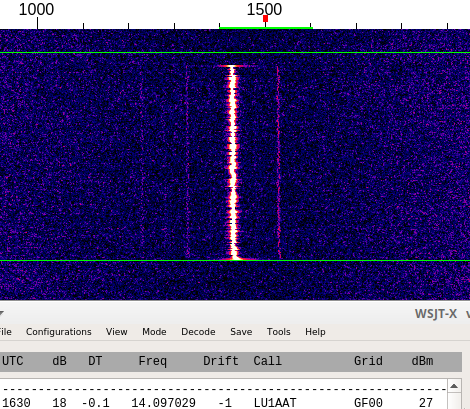
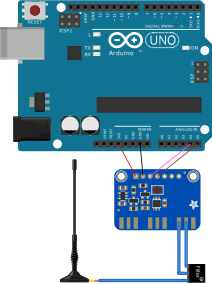

# wspr-si5351

WSPR very basic implementation using Arduino, Si5351 and JTEncode library. A refactor of the JTEncode example code but without the clutter for other modes.

This code is for testing purposes or as a skeleton for more advance proyects, **use a filter at the output of the Si5351** if will be used for real.




## Usage

Once the code is uploaded, it will start TX as soon and connected to power. Sync should be done manually arround one second before the "0" seconds of the WSPR transmision. See lower-right corner of WSJT-X software.


## Assambly instructions

* Download `wspr-si5351.ino` file and open with [Arduino IDE](https://www.arduino.cc/en/main/software).
* Upload to Arduino UNO (o compatible) microcontroller.
* Wire the Si5351 module with the Arduino UNO (or compatible) board:

    * Arduino 3V    -   Si5351 VIN
    * Arduino GND   -   Si5351 GND
    * Arduino A4    -   Si5351 SDA
    * Arduino A5   -    Si5351 SCL



For testing without soldering the SMA connector, a wire connected to output _0_ of the Si5351 can be used as compromise antenna.

## Settings

Values for frecuency, callsign, grid, power and TX led can be changed in the source code.

### TX Frecuency

Can be changed from the `WSPR_FREQ` constant. Defaults for 20 meters band, be aware that must be shifted a little to be in the center of the WSPR frecuency. Frecuency 14.096,90 MHz worked for me (14.094,60 is the frecuency for 20 meter band in WSJT-X).

```c
#define WSPR_FREQ       14096900UL  // 20M, 14.094,60
```

### Led, callsign, grid locator and power

```c
#define LED_PIN                 13
char call[] = "N0CALL";
char loc[] = "GF00";
uint8_t dbm = 27;
```

## Help

- LU1AAT, Andres
- lu1aat.andres @ gmail.com